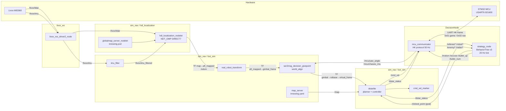

# 哨兵 Robot — Full-Stack Technical Report
**Workspace root:** `/Users/jiahangx/Library/Mobile Documents/com~apple~CloudDocs/HerKules/哨兵`
**Platform:** ROS Noetic (Ubuntu 20.04) · Livox MID360 LiDAR · STM32 MCU @ 921600 baud
**Compiled from source inspection on 2026-04-23**

---

## 0. Executive Summary

The `哨兵` (Sentry) repository implements an autonomous RoboMaster sentry robot composed of three tightly-coupled ROS workspaces plus one **SLAM algorithm stack**:

| Layer | Workspace / Folder | Role |
|---|---|---|
| Decision | `decision_node/DecisionNode/` | BehaviorTree-based tactical brain + MCU serial bridge |
| LiDAR driver | `Old_Nav/livox_ws/` | Livox MID360 ROS driver (`livox_ros_driver2`) |
| Perception / Nav | `Old_Nav/sim_nav/` (catkin) | SLAM algorithms + **primary** nav stack `bot_sim` (D*-Lite) |
| Nav filter exp. | `Old_Nav/Navigation-filter-test/` | point-cloud filter research package |
| Standardization | `Old_Nav/standarlization/` | LiDAR–IMU extrinsic init (`LiDAR_IMU_Init`) |
| Top-level launch | `Old_Nav/*.launch` + `run_3DNavUL_Test_with_decision.sh` | Combined entrypoint |

The **active runtime** (verified via `3DNavUL_Test_with_decision.launch` + the systemd shell wrapper `run_3DNavUL_Test_with_decision.sh`) is:

```
Livox MID360 driver  ──►  imu_filter  ──►  hdl_localization (NDT on pre-built .pcd map)
                                      │
map_server (2D .yaml map)  ──►  dstarlite (D*-Lite planner + controller) ──► /cmd_vel
                                      │
strategy_node (BehaviorTree_CPP v3)  ──► /clicked_point  (goal)
                                      │
mcu_communicator  ◄──── UART HK-frame (921600) ────►  STM32 (chassis + gimbal + referee)
```

Point-LIO, hdl_graph_slam, FAST_LIO_LOCALIZATION, LiDAR_IMU_Init are **available but not in the active launch chain**; they are used offline for (a) building the `.pcd` global map, (b) estimating LiDAR–IMU extrinsics, and (c) experimentation.

---

## 1. Top-Level Entry Points

### 1.1 `run_3DNavUL_Test_with_decision.sh` (systemd wrapper)
Location: [Old_Nav/run_3DNavUL_Test_with_decision.sh](../Old_Nav/run_3DNavUL_Test_with_decision.sh)

Responsibilities:
1. Source all catkin workspaces: `livox_ws`, `sim_nav`, `Navigation-filter-test`, `DecisionNode`.
2. Wait for `/dev/ttyUSB0` (MCU serial) up to `TTYUSB_WAIT_SECONDS=5`.
3. Start `roscore` if absent.
4. **Continuous `rosbag record -a --lz4`** split every 60 s into `Old_Nav/logs/rosbag_<ts>_<n>.bag`; graceful SIGINT rename on shutdown.
5. `roslaunch --wait /home/sentry/AstarTraining/Old_nav/3DNavUL_Test_with_decision.launch`.

### 1.2 `3DNavUL_Test_with_decision.launch`
Location: [Old_Nav/3DNavUL_Test_with_decision.launch](../Old_Nav/3DNavUL_Test_with_decision.launch)

Pure aggregator. Includes three child launch files with overridable paths:

| Child | Purpose |
|---|---|
| `3DNavUL_Test.launch` | Nav + localization stack |
| `mcu_communicator.launch` | Serial bridge |
| `strategy_decision_tmp.launch` | BehaviorTree strategy |

Exposed args: `serial_port=/dev/ttyUSB0`, `baudrate=921600`, `nav_frequency=50`, `mcu_output=screen`.

### 1.3 `3DNavUL_Test.launch` — Active navigation stack
Location: [Old_Nav/3DNavUL_Test.launch](../Old_Nav/3DNavUL_Test.launch)

Includes (in order):
1. `bot_sim/launch_real/map_server.launch` — loads 2-D occupancy grid (`innowing.yaml`).
2. `bot_sim/launch_real/imu_filter.launch` — `/livox/imu → /livox/imu_filtered`.
3. `livox_ros_driver2/launch_ROS1/rviz_MID360.launch` — Livox MID360 driver + RViz.
4. `hdl_localization/launch/hdl_localization.launch` — NDT map-based localization.
5. `bot_sim/launch_real/real_robot_transform.launch` — TF broadcaster `aft_mapped → gimbal_frame`.
6. `bot_sim/launch_real/dstarlite.launch` — D*-Lite planner + `cmd_vel_marker`.
7. `bot_sim/launch_real/ser2msg_tf_decision_givepoint.launch` — chassis-yaw / virtual-frame TF glue.

### 1.4 Offline / auxiliary entries

| Launch | Purpose |
|---|---|
| [Old_Nav/3DSlamFinal_lio.launch](../Old_Nav/3DSlamFinal_lio.launch) | Point-LIO online SLAM via `mapping_avia.launch` (Livox CustomMsg) |
| [Old_Nav/hdl_graph_slam_mapping.launch](../Old_Nav/hdl_graph_slam_mapping.launch) | hdl_graph_slam (+IMU) map building with auto-save via `save_map_on_update.py` |

---

## 2. Decision Layer — `decision_node/DecisionNode`

Package: **`decision_node`** (catkin, ROS Noetic)
Path: [decision_node/DecisionNode/src/decision_node](../decision_node/DecisionNode/src/decision_node)

Dependencies: `behaviortree_cpp_v3`, `roscpp`, `serial`, `std_msgs`, `geometry_msgs`, `ros_package`.

### 2.1 Nodes / Executables

| Executable | Source | Role |
|---|---|---|
| `strategy_node` | [src/strategy_node.cpp](../decision_node/DecisionNode/src/decision_node/src/strategy_node.cpp) | Main BehaviorTree tick loop |
| `mcu_communicator` | [src/mcu_communicator.cpp](../decision_node/DecisionNode/src/decision_node/src/mcu_communicator.cpp) | HK-protocol serial bridge |
| `command_test` | [src/command_test.cpp](../decision_node/DecisionNode/src/decision_node/src/command_test.cpp) | Manual goal-forwarder for offline BT validation |
| `test` / `continuous_forwarder` | [src/test.cpp](../decision_node/DecisionNode/src/decision_node/src/test.cpp) | Developer helper |

### 2.2 BehaviorTree — `strategy_node`

- Library: **BehaviorTree.CPP v3** (`bt_factory.h`).
- XML: [config/strategy_tree.xml](../decision_node/DecisionNode/src/decision_node/config/strategy_tree.xml) (loadable with Groot2).
- Tick: private param `tick_hz` default **20 Hz**.
- **43 custom nodes** in 7 groups — catalogued in [BehaviorTree_Nodes_Summary_简洁版.md](../decision_node/DecisionNode/BehaviorTree_Nodes_Summary_简洁版.md) and [README.md](../decision_node/DecisionNode/README.md).

#### Node groups

1. **占位 (Central Occupiable)** — `AccumulateCentralOccupiable`, `TriggerOnThreshold`, `ResetAccumulator`, `ResetCentralOccupiable`, `IsOccupyStatusFavorable`.
2. **追逐 (Chase)** — `InitChase`, `UpdateChaseTarget`, `PublishChaseGoal`, `ResetChase`.
3. **运动控制 (Motion)** — `CheckArrived`, `CheckAttacked`, `SetMotionFlag`, `PublishMotion` (motion_flag: 0 stop / 1 patrol / 2 evade / 3 push; 5 s cooldown between 0–2).
4. **恢复/补给 (Recover & Supply)** — `IsHealthFull`, `SetRecover`, `IsBulletFull`, `SetBulletUp`, `PublishRecover`, `PublishBulletUp`, `SetBulletNum` (DELTA/FIXED), `PublishBulletNum`.
5. **黑板更新 (State)** — `UpdateRefereeBB`, `UpdateNavigationBB`, `UpdateVisionBB` (stub), `UpdateTimersBB` (stub), `UpdateDerivedFlags` (computes `derived.damage_2s`, `is_dead`, `is_in_danger`, `bullet_sufficient`).
6. **条件 (Conditions)** — `IsGameStarted`, `IsSentryDead`, `IsSentryAlive`, `IsSentryInDanger`, `NotBulletSufficient`, `AggressiveAdvantage`, `IsAction`, `IntenseHarm` (hysteresis).
7. **行动 (Actions)** — `SetAction` (INIT/INITPUSH/PUSH/OCCUPY/SUPPLY/RESPAWN/RADICAL/RADICAL1/WAITFOROP), `ClearGoal`, `Wait`, `SetGoalFromParams`, `SetGoalFromParamsCyclic`, `AdvanceCycleIndex`, `PublishGoalPoint`.

#### Top-level BT (ReactiveSequence):
```
1. UpdateBlackboard
   UpdateRefereeBB → UpdateNavigationBB → UpdateVisionBB → UpdateTimersBB → UpdateDerivedFlags
2. DecideAction (ReactiveFallback) — selects action based on priorities:
   Dead → RESPAWN; Respawn+Alive → SUPPLY; InDanger → SUPPLY;
   Init+GameStart → PUSH; PUSH+Arrived → OCCUPY; AggressiveAdvantage → RADICAL; default WAITFOROP.
3. ExecuteAction (ReactiveFallback) — publishes goal:
   PUSH/OCCUPY → SetGoalFromParamsCyclic ns=occupy point_count=2
   SUPPLY → ns=supply; RADICAL/RADICAL1 → ns=radical/radical1; WAITFOROP → ns=waitforop
   All terminate with PublishGoalPoint topic=clicked_point.
```

### 2.3 Topics — `strategy_node`

| Direction | Topic | Type | Source/Sink |
|---|---|---|---|
| Sub | `/referee/game_progress` | `std_msgs/UInt8` | mcu_communicator |
| Sub | `/referee/remain_hp` `/referee/bullet_remain` `/referee/occupy_status` | `std_msgs/UInt16` / `UInt8` | mcu_communicator |
| Sub | `/referee/red_{1,3,7}_hp` `/referee/blue_{1,3,7}_hp` `/referee/red_dead` `/referee/blue_dead` | UInt16 | mcu_communicator |
| Sub | `/referee/friendly_score` `/referee/enemy_score` | `std_msgs/Int32` | mcu_communicator |
| Sub | `/enemy/{hero,engineer,standard_3,standard_4,sentry}_position` | `geometry_msgs/Point` | mcu_communicator (radar) — `-8888` = sentinel "invalid", cached by BB |
| Sub | `/radar/suggested_target` | `std_msgs/UInt8` | mcu_communicator |
| Sub | `/robot/robot_id` `/robot/robot_color` `/robot/self_hp` `/robot/self_max_hp` | UInt8/UInt16 | mcu_communicator |
| Sub | `/dstar_status` | `std_msgs/Bool` | dstarlite (arrived) |
| Pub | `/clicked_point` | `geometry_msgs/PointStamped` | → dstarlite goal |
| Pub | `/motion` `/recover` `/bullet_up` `/bullet_num` | various | → mcu_communicator |

### 2.4 Key parameters (strategy_decision_tmp.launch)

File: [launch/strategy_decision_tmp.launch](../decision_node/DecisionNode/src/decision_node/launch/strategy_decision_tmp.launch)

| Arg | Default | Meaning |
|---|---|---|
| `tick_hz` | 20 | BT tick frequency |
| `danger_hp` | 200 | Below → go SUPPLY |
| `max_hp` | 380 | Full-HP threshold |
| `max_bullet` / `sufficient_bullet` | 750 / 150 | Ammo logic |
| `fixed_supply` | 50 | `SetBulletNum` FIXED mode |
| `occupy_threshold` | 50 | Accumulator fires |
| `aggressive_threshold` | 50 | `AggressiveAdvantage` |
| `attack_threshold` | 30 | `CheckAttacked` HP-drop |
| `harm_threshold_on/off` | 50 / 10 | IntenseHarm hysteresis |
| `bt_xml` | `$(find decision_node)/config/strategy_tree.xml` | BT XML |
| `goal_topic` | `/clicked_point` | Output remap target |
| `/goals/occupy/point_{0..3}/{x,y}` | see file | RMUL 2026 field coords |
| `/goals/{supply,waitforop,retreat,radical,radical1}/{x,y}` | see file | Tactical points |

### 2.5 `mcu_communicator` — HK UART bridge

Header: [include/decision_node/mcu_comm.hpp](../decision_node/DecisionNode/src/decision_node/include/decision_node/mcu_comm.hpp)
Source: [src/mcu_communicator.cpp](../decision_node/DecisionNode/src/decision_node/src/mcu_communicator.cpp)
Launch: [launch/mcu_communicator.launch](../decision_node/DecisionNode/src/decision_node/launch/mcu_communicator.launch)

**Protocol (HK)**
- Serial: 921600 8N1.
- SOF `'H' 0x48, 'K' 0x4B`; trailer `'K' 0x4B, 'H' 0x48`.
- Header 10 bytes: `sof[2], length(le16), packet_type, reserved, packet_seq, reserved2, header_crc8`.
- Packet types: `0x01` = Game Data (MCU → PC), `0x02` = Navigation (PC → MCU, **21-byte static_assert'd**).
- Trailer CRC16 over bytes 0 … (len − 4).

**Nav frame (PC→MCU) payload**
`reserved0, at_place, vx (int16 mm/s), vy (int16 mm/s), wz (int16 0.01 rad/s)`
— produced by `sendNavigationCommand()`, driven by `cmd_vel` subscription + `navigation_timer_` at `nav_frequency=50` Hz.

**Subscriptions**

| Topic | Type | Use |
|---|---|---|
| `/cmd_vel` | `geometry_msgs/Twist` | vx/vy/wz → MCU nav frame |
| `/navigation` | `geometry_msgs/Vector3` | alternative direct drive |
| `/nav_received` | `std_msgs/UInt8` | ACK tracking |
| `/dstar_status` | `std_msgs/Bool` | `at_place` flag |

**Publications** (feed strategy_node BT):
all `/referee/*`, `/robot/*`, `/enemy/*`, `/radar/*` plus `/mcu/yaw_angle` and `/mcu/chassis_imu` (`std_msgs/Float32`) from the MCU gimbal/chassis IMU.

The node hot-reopens the serial port if `/dev/ttyUSB0` disappears (robust for USB re-enumeration). Score tracking (`friendly_score_` / `enemy_score_`) and dead-bit state machines are implemented locally based on referee-frame deltas.

---

## 3. SLAM Layer

Reference: [AAAnotes/架构.txt](架构.txt) — the team architecture diagram.

### 3.1 Algorithmic building blocks

| Pkg | Path | Role | In active chain? |
|---|---|---|---|
| `ndt_omp` | `Old_Nav/sim_nav/src/ndt_omp/` | OpenMP-parallel NDT scan-matcher (pcl drop-in) | **Yes** (used by hdl_localization) |
| `fast_gicp` | `Old_Nav/sim_nav/src/fast_gicp/` | Parallel GICP/VGICP, optional CUDA | Yes (used by hdl_graph_slam) |
| `Point-LIO` | `Old_Nav/sim_nav/src/Point-LIO/` | HKU high-bandwidth LIO (4-8 kHz odom, IMU-saturation tolerant) | No — only via `3DSlamFinal_lio.launch` for online SLAM |
| `LiDAR_IMU_Init` | `Old_Nav/sim_nav/src/LiDAR_IMU_Init/` + `standarlization/src/` | Online LiDAR-IMU extrinsic init | Offline tool |
| `FAST_LIO` | `Old_Nav/sim_nav/src/FAST_LIO/` | Alternative LIO | Offline |

See: [AAAnotes/ndt-omp.md](ndt-omp.md), [AAAnotes/point_lio.md](point_lio.md).

### 3.2 Mapping subsystem — `hdl_graph_slam`

Path: `Old_Nav/sim_nav/src/hdl_graph_slam/` · Notes: [AAAnotes/hdl_graph_slam.md](hdl_graph_slam.md).

Four nodelets:
- `prefiltering_nodelet` — voxel-downsample / ROI
- `scan_matching_odometry_nodelet` — front-end odometry via ndt_omp or fast_gicp
- `floor_detection_nodelet` — RANSAC floor plane
- `hdl_graph_slam_nodelet` — g2o pose-graph back-end (loop-closure, GPS/IMU/floor constraints)

**Output:** `/hdl_graph_slam/map_points` → saved to `$(find hdl_graph_slam)/map/mapping_result.pcd` by the helper `save_map_on_update.py` (triggered from [Old_Nav/hdl_graph_slam_mapping.launch](../Old_Nav/hdl_graph_slam_mapping.launch) at 10 s interval).

Top-level mapping entry: [Old_Nav/hdl_graph_slam_mapping.launch](../Old_Nav/hdl_graph_slam_mapping.launch)
- Topics remapped: `points_topic=/livox/lidar`, `imu_topic=/livox/imu_filtered`, `frame=gimbal_frame`.
- Two sub-launches selected by arg `enable_imu`: `hdl_graph_slam_imu.launch` (default) vs. `hdl_graph_slam.launch`.
- Optional rosbag playback (`play_bag`, `bag_file`, `bag_rate`).

### 3.3 Online localization — `hdl_localization` (**runtime-critical**)

Path: `Old_Nav/sim_nav/src/hdl_localization/` · Notes: [AAAnotes/hdl_localization.md](hdl_localization.md).
Launch: `Old_Nav/sim_nav/src/hdl_localization/launch/hdl_localization.launch`

Two nodelets hosted by `velodyne_nodelet_manager`:

| Nodelet | Function |
|---|---|
| `globalmap_server_nodelet` | Publishes preloaded `.pcd` — current: `$(find hdl_graph_slam)/map/innowing.pcd` at resolution 0.1. |
| `hdl_localization_nodelet` | UKF pose estimator + **NDT_OMP DIRECT7** scan-matching (`ndt_resolution=1.0`, `downsample_resolution=0.1`, `cool_time_duration=2.0`). |

Key params (hard-coded init pose):
```
init_pos  = (10.108, -4.187, 0.0)
init_ori  = (w=0.0546, x=0, y=0, z=-0.9985)
use_imu=true, invert_imu_acc=true, invert_imu_gyro=false
use_global_localization=false   # hdl_global_localization available but disabled
```

Remaps: `/velodyne_points ← livox/lidar`, `/gpsimu_driver/imu_data ← /livox/imu_filtered`.

**Published**
- `/odom` (`nav_msgs/Odometry`) — pose of `aft_mapped` in `map`.
- `/aligned_points` — registered cloud.
- `/status` (`hdl_localization/ScanMatchingStatus`).
- TF: `map → aft_mapped`.

**Service**: `/relocalize` (`std_srvs/Empty`) — triggers hdl_global_localization if enabled.

### 3.4 Global relocalization — `hdl_global_localization`

Notes: [AAAnotes/hdl_global_localization.md](hdl_global_localization.md). Path `Old_Nav/sim_nav/src/hdl_global_localization/`.
Engines: BBS (2D grid branch-and-bound), FPFH+RANSAC, FPFH+Teaser++.
Services: `/hdl_global_localization/{set_engine,set_global_map,query}`. Not launched by the active chain; kept for recovery.

### 3.5 Mode summary

| Mode | Launch | Active |
|---|---|---|
| Mapping | `hdl_graph_slam_mapping.launch` (or `3DSlamFinal_lio.launch` for Point-LIO) | Offline |
| Online localization | `hdl_localization.launch` (inside `3DNavUL_Test.launch`) | **Live** |
| Global recovery | `hdl_global_localization.launch` | Disabled flag |

---

## 4. Navigation Layer — `bot_sim`

Package: **`bot_sim`** (catkin) · Path: `Old_Nav/sim_nav/src/bot_sim`

This is **the primary nav package**. It is NOT `move_base` / `teb_local_planner` — those configs are archived under `*.backup`. The active pipeline uses a custom **D*-Lite** planner fused with a velocity controller, consuming a 2-D occupancy grid.

### 4.1 Source tree (`src/`)

| Executable | Purpose |
|---|---|
| `dstarlite` | D*-Lite planner **+** controller (emits `/cmd_vel` directly) |
| `dstarlite_test_while` | Debug variant |
| `dwa` | Legacy DWA (not in chain) |
| `dbscan_bfs_3D` | 3-D obstacle clustering → `/grid` |
| `threeD_lidar_merge_pointcloud` | Multi-LiDAR merger (currently used to forward `/livox/lidar` into `/3Dlidar`) |
| `threeD_lidar_filter_pointcloud` | Point-cloud ROI filter |
| `imu_filter` | Applies `-gravity` scaling + 20° x-axis rotation on `/livox/imu → /livox/imu_filtered` |
| `real_robot_transform` | TF bridge: listens `aft_mapped→map` and rebroadcasts normalized `aft_mapped→gimbal_frame` (yaw-projected, roll/pitch zero) |
| `ser2msg_decision_givepoint` | Publishes `rotbase_frame→virtual_frame` TF from gimbal-yaw + chassis-IMU, plus world alignment (K/theta/shift) |
| `world_align_node` | 2-D world frame alignment for game field |
| `calculate_shift_theta` | Offline helper to derive world transform |
| `pointcloud_converter` | Livox CustomMsg → PointCloud2 converter |
| `cmd_vel_marker` | RViz visualization of `/cmd_vel` |

Helper Python under `scripts/`: `livox_to_pointcloud2.py`, `goal_to_clicked_point.py`, `map_image_publisher.py`, `patrol.py`, `local_frame_bridge.py`, `LidarMonitor.py`.

### 4.2 Launch files consumed by `3DNavUL_Test.launch`

| File | Creates |
|---|---|
| `launch_real/map_server.launch` | `map_server` loading `$(find bot_sim)/map/innowing.yaml` (OccupancyGrid on `/map`) |
| `launch_real/imu_filter.launch` | `/livox/imu → /livox/imu_filtered` |
| `launch_real/real_robot_transform.launch` | TF bridge (`aft_mapped → gimbal_frame`) |
| `launch_real/dstarlite.launch` | `dstarlite` + `cmd_vel_marker` |
| `launch_real/ser2msg_tf_decision_givepoint.launch` | `ser2msg_decision_givepoint` + `world_align` |
| *(commented out)* `lidar_merge_pointcloud.launch` | Would remap `/livox/lidar` → `/3Dlidar` |

### 4.3 `dstarlite` node — planner + controller

Source: `Old_Nav/sim_nav/src/bot_sim/src/dstarlite.cpp`

Parameters (from launch):

| Param | Default | Meaning |
|---|---|---|
| `map_topic_name` | `/map` | Static occupancy grid |
| `map_frame_name` | `map` | |
| `robot_frame_name` | `virtual_frame` | Robot pose source (chassis-aligned) |
| `dynamic_map_topic_name` | `/grid` | Dynamic obstacles |
| `goal_topic_name` | `/clicked_point` | Goal input (fed by BT) |
| `x0_grid, k_grid, L_grid` | 60, 0.3, 10 | Sigmoid for **edge cost** around obstacles |
| `x0_velocity, k_velocity, L_velocity` | 130, -0.25, 1.5 | Sigmoid velocity shaping vs. path curvature |
| `start_decrease_dis, min_velocity_rate` | 2.0, 0.2 | Deceleration when approaching goal |

Logic:
- Classic D*-Lite with incremental re-planning on occupancy changes.
- `publish_vel()` converts path tangent → 2-D velocity vector in `virtual_frame`, rotates into chassis via TF, applies z-angle tilt compensation (`std::min(1 - z_angle/15°, 1.7)` for x, `std::max(…, 0.7)` for y) and sigmoid-based speed clamp.
- Emits:
  - `/cmd_vel` (`geometry_msgs/Twist`) → MCU bridge
  - `/dstar_status` (`std_msgs/Bool`) → strategy_node `CheckArrived`
  - Path visualization + map status topics.

### 4.4 `ser2msg_decision_givepoint` — gimbal / chassis TF bridge

Source: `Old_Nav/sim_nav/src/bot_sim/src/ser2msg_decision_givepoint.cpp` (serial-port code **disabled**; now subscribes to `/mcu/yaw_angle` and `/mcu/chassis_imu`).

Published TFs:
- `gimbal_frame → rotbase_frame` (rotate by `-yaw`)
- `rotbase_frame → virtual_frame` (world alignment, params `theta, shift_x, shift_y, K`)

This converts the LIO-localized `aft_mapped`/`gimbal_frame` pose into the `virtual_frame` that the D*-Lite planner uses as "robot frame", decoupling the rotating gimbal from the chassis-forward controller.

### 4.5 Map assets

Directory: `Old_Nav/sim_nav/src/bot_sim/map/`
Active map: `innowing.yaml/.pgm` (2-D occupancy) + `innowing.pcd` (in `hdl_graph_slam/map/`, 3-D for hdl_localization). Historical maps for RMUC / RMUL 2025-2026 / hit723 / basket_court are archived.

### 4.6 Auxiliary packages

| Package | Location | Role |
|---|---|---|
| `pcd2pgm_package` | `Old_Nav/sim_nav/src/pcd2pgm_package/` | Convert `hdl_graph_slam` `.pcd` → `map_server`-compatible 2-D `.pgm` |
| `livox_cloudpoint_processor` | `Old_Nav/Navigation-filter-test/src/livox_cloudpoint_processor/` | Pre-processing / noise removal research |
| `LiDAR_IMU_Init` | `Old_Nav/standarlization/src/LiDAR_IMU_Init/` | Online extrinsic calibration (LIDAR↔IMU) — pre-deployment |
| `dm_imu` | `Old_Nav/sim_nav/src/dm_imu/` | Alternate IMU driver (not in active chain) |

---

## 5. LiDAR Driver Workspace — `livox_ws`

Path: `Old_Nav/livox_ws/src/livox_ros_driver2`

Active launch: `launch_ROS1/rviz_MID360.launch` (MID360 sensor + RViz). Publishes:
- `/livox/lidar` (`sensor_msgs/PointCloud2`, `frame_id=livox_frame` or overridden to `gimbal_frame` per `msg_frame_id`)
- `/livox/imu` (`sensor_msgs/Imu`)
- For Point-LIO path: `msg_mixed.launch` publishes Livox **CustomMsg** (required for per-point timestamps).

Device config: `livox_ros_driver2/config/MID360_config.json` (IP / broadcast code `100000000000000`, `publish_freq=10`).

---

## 6. Data-Flow Diagram



### Coordinate frames (TF tree, simplified)

```
map
└─ aft_mapped                 (hdl_localization output)
   └─ gimbal_frame            (real_robot_transform – yaw/pitch/roll reset)
      └─ rotbase_frame        (ser2msg_decision_givepoint – un-rotated gimbal)
         └─ virtual_frame     (world-aligned chassis frame, consumed by dstarlite)
```

- `map` origin = pre-built `.pcd` origin (UTM-disabled).
- `gimbal_frame` = physical LiDAR mounting at 0° roll/pitch; rotation offset params available but defaulted to 0.
- `virtual_frame` = chassis-forward axis after world alignment; parameters `theta=1.572418 rad`, `shift_x=15.65`, `shift_y=3.21`, `K=2.5` map arena coords to robot coords.

---

## 7. Component Index (summary table)

| # | Layer | Package | Path | Main exec. | Key topics |
|---|---|---|---|---|---|
| 1 | Driver | livox_ros_driver2 | Old_Nav/livox_ws/src/livox_ros_driver2 | `livox_ros_driver2_node` | `/livox/lidar` `/livox/imu` |
| 2 | SLAM | hdl_localization | Old_Nav/sim_nav/src/hdl_localization | nodelets | `/odom`, TF `map→aft_mapped` |
| 3 | SLAM (offline) | hdl_graph_slam | Old_Nav/sim_nav/src/hdl_graph_slam | 4 nodelets | `/hdl_graph_slam/map_points` |
| 4 | SLAM (backup) | hdl_global_localization | …/hdl_global_localization | BBS/FPFH services | `/hdl_global_localization/*` |
| 5 | LIO alt. | Point-LIO | …/Point-LIO | `pointlio_mapping` | `/Odometry`, `/cloud_registered` |
| 6 | Nav | bot_sim (dstarlite) | Old_Nav/sim_nav/src/bot_sim | `dstarlite` | `/cmd_vel`, `/dstar_status` |
| 7 | Nav util | bot_sim (tf) | same | `real_robot_transform`, `ser2msg_decision_givepoint`, `imu_filter`, `cmd_vel_marker` | TF tree, `/livox/imu_filtered` |
| 8 | Map | map_server | ROS stock | — | `/map` |
| 9 | Decision | decision_node | decision_node/DecisionNode/src/decision_node | `strategy_node`, `mcu_communicator` | `/clicked_point`, `/referee/*`, `/enemy/*`, `/motion` |
| 10 | Extrinsic cal. | LiDAR_IMU_Init | Old_Nav/standarlization + sim_nav/src/LiDAR_IMU_Init | offline | — |
| 11 | 3-D → 2-D | pcd2pgm_package | Old_Nav/sim_nav/src/pcd2pgm_package | offline CLI | — |
| 12 | Filters | livox_cloudpoint_processor | Old_Nav/Navigation-filter-test/src/livox_cloudpoint_processor | research | — |

---

## 8. Integration & Sequencing Notes

1. **Startup order (systemd):** ensure `/dev/ttyUSB0` present → `roscore` → `livox_ros_driver2` → `map_server` → `hdl_localization` → `dstarlite` → `strategy_node` + `mcu_communicator`. Because all are in one `roslaunch` this is not strictly enforced; the shell wrapper inserts waits. `mcu_communicator` is tolerant of a missing serial port at boot and retries.
2. **Pose loop:** LiDAR cloud + IMU → NDT in `hdl_localization` (10 Hz) → TF `map→aft_mapped` → `real_robot_transform` normalizes yaw-only → `ser2msg_decision_givepoint` fuses MCU gimbal-yaw to produce a planner-usable `virtual_frame` → `dstarlite` reads robot pose via TF.
3. **Goal loop:** BT ticks @ 20 Hz → selects an action string (PUSH/OCCUPY/…) → reads `/goals/<ns>/…` params → publishes `geometry_msgs/PointStamped` on `/clicked_point` → `dstarlite` triggers re-plan if changed.
4. **Control loop:** `dstarlite` emits `/cmd_vel` (chassis-frame). `mcu_communicator` scales to mm/s & 0.01 rad/s, packs into a 21-byte HK nav frame, sends over UART at **50 Hz fixed** (timer, not cmd_vel rate).
5. **Arrival feedback:** `dstarlite` → `/dstar_status` (`Bool`) → both `mcu_communicator` (sets `at_place`) and `strategy_node` (`CheckArrived`).
6. **Referee loop:** MCU frames (type 0x01) deserialize in `mcu_communicator` → `/referee/*` + `/enemy/*` → `UpdateRefereeBB` populates BT blackboard. Invalid radar coords `-8888` are handled by **both** sides (cached last-good).
7. **Health/ammo tracking:** `UpdateDerivedFlags` maintains a 2 s rolling damage deque → `derived.damage_2s` → `IntenseHarm` uses hysteresis to latch evasive behaviour.
8. **Rosbag:** `run_3DNavUL_Test_with_decision.sh` continuously records `rosbag -a --lz4`, rotating every 60 s, with a shutdown-specific filename on SIGTERM (graceful).

---

## 9. Known Gaps & TODOs (from code)

- `UpdateVisionBB`, `UpdateTimersBB` are **stubs** (comments mark as placeholders).
- `hdl_global_localization` integration is wired but **disabled** (`use_global_localization=false`); no automatic `/relocalize` trigger on scan-match divergence.
- Vision-based enemy tracking is deferred — enemy positions currently come solely from radar/referee via MCU.
- Several commented-out branches in `strategy_tree.xml` (`SwitchRadicalToRadical1`, attacked → evade patterns) and `SetMotionFlag`/`PublishMotion` flow — the active XML only drives goals, not motion flags.
- Extensive `.backup` launch / source files (`ser2msg_decision_givepoint.cpp.backup`, `dbscan_bfs_3D.launch.backup`, TEB config, etc.) mark superseded implementations; any revival requires auditing these first.

---

## 10. Top-level Launch Entrypoint Cheat-Sheet

| Task | Command |
|---|---|
| **Production (live robot)** | `bash Old_Nav/run_3DNavUL_Test_with_decision.sh` (systemd-friendly) |
| Production (manual) | `roslaunch Old_Nav/3DNavUL_Test_with_decision.launch` |
| Nav-only (no MCU / no BT) | `roslaunch Old_Nav/3DNavUL_Test.launch` |
| Build a new 3-D map | `roslaunch Old_Nav/hdl_graph_slam_mapping.launch` (then convert PCD→PGM via pcd2pgm_package) |
| Point-LIO mapping / tuning | `roslaunch Old_Nav/3DSlamFinal_lio.launch` |
| Decision only (test BT w/o nav) | `roslaunch decision_node strategy_decision_tmp.launch` |
| Decision + MCU (no nav) | `roslaunch decision_node decision_with_communicator.launch` |
| MCU-only | `roslaunch decision_node mcu_communicator.launch` |
| Manual BT stimulation | `./decision_node/DecisionNode/devel/lib/decision_node/continuous_forwarder` |
| BT visualization | Open `decision_node/DecisionNode/src/decision_node/config/strategy_tree.xml` in Groot2 |
